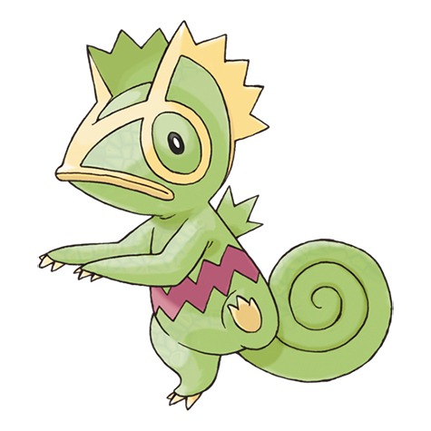

# Kecleon

Unsupervised style-transfer.

> Kecleon is capable of changing its body colors at will to blend in with its surroundings. There is one exception - this Pokémon can't change the zigzag pattern on its belly.

This repository is an attempt at creating a style-transfer AI that will generate backgrounds in an arbitrary style.
